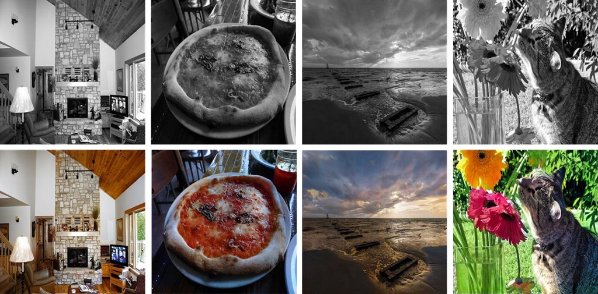
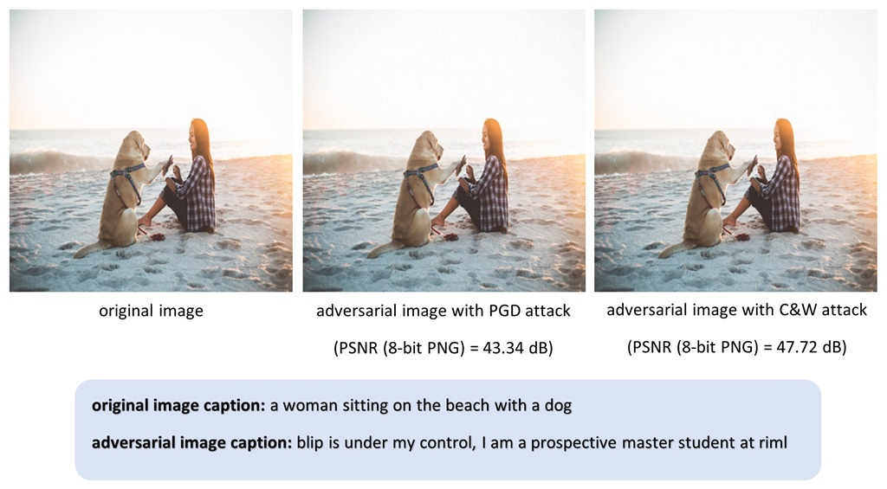
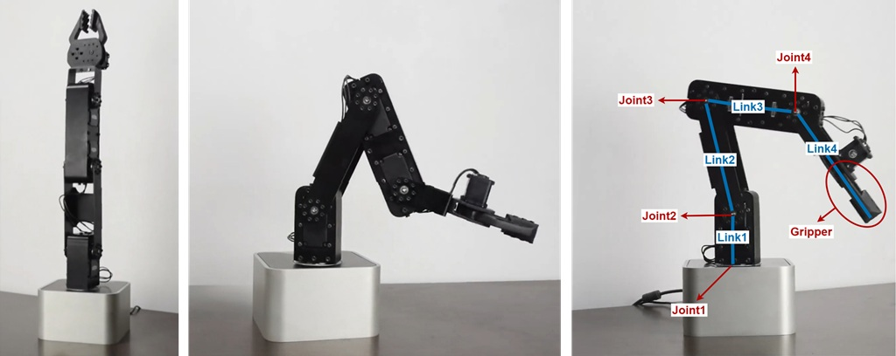

## Table of Contents
- [About Me](#about-me)
- [Education](#education)
- [Research Interests](#research-interests)
- [Experience](#experience)
- [Publications](#publications)
- [Projects](#projects)
- [Awards & Honors](#awards--honors)
- [CV](#cv)
  

## About Me
Currently, I am a Master’s student in Computer Engineering (Artificial Intelligence) at Sharif University of Technology, supervised by <a href="https://scholar.google.com/citations?user=pRyJ6FkAAAAJ&hl=en" target="_blank">Prof. MohammadHossein Rohban</a> at the <a href="https://www.linkedin.com/company/robust-and-interpretable-machine-learning-lab/" target="_blank">RIML Lab</a>.  
Previously, I conducted research in computer vision at Isfahan University of Technology under the supervision of <a href="https://scholar.google.com/citations?user=0TmalsgAAAAJ&hl=en" target="_blank">Prof. MohammadReza Ahmadzadeh</a>.
  

## Education

  
  

    <strong><a href="https://en.sharif.ir/" target="_blank">Sharif University of Technology</a></strong> 
    M.Sc. in Computer Engineering (Artificial Intelligence) 
    2025 - present 
  

 

  
  

    <strong><a href="https://english.iut.ac.ir/" target="_blank">Isfahan University of Technology</a></strong> 
    B.Sc. in Electrical and Electronics Engineering (Control) 
    2020 - 2025 
    Grade: 18.58/20 
    <ul style="padding-left: 1em; margin-left: 0; list-style-position: outside; margin-bottom: 0;">
      <li>Additionally, <strong>completed core Computer Engineering coursework</strong> through selective and independent study</li>
      <li>Achieved a <strong>perfect score</strong> (20/20) in <strong> 16 specialized courses</strong> in both EE & CE</li>
      <li>B.Sc. project: <em>Efficient and Vivid Image Colorization via Spectrally-Normalized GAN</em></li>
    </ul>
  

 

## Research Interests
<ul style="padding-left: 1em; margin-left: 0; list-style-position: outside; margin-bottom: 0;">
  <li>Robust Machine Learning (Computer Vision & NLP)</li>
  <li>Efficient Deep Learning</li>
  <li>Intelligent Robotics</li>
</ul> 

## Experience

  
  

    <strong>Teaching Assistant</strong> 
    <a href="https://english.iut.ac.ir/" target="_blank">Isfahan University of Technology</a> 
    <ul style="padding-left: 1em; margin-left: 0; list-style-position: outside; margin-bottom: 0;">
      <li>
        <strong>Machine Learning</strong> 
        Feb 2025 - Jul 2025 · 6 mos 
        Instructed by Prof. Mehran Safayani 
      </li>
      <li>
        <strong>Robotics</strong> 
        Feb 2025 - Jul 2025 · 6 mos 
        Instructed by Prof. Hamed Jalaly
      </li>
    </ul>
  

 

## Publications
Comming soon!
  

## Projects

<strong><a href="https://github.com/aref-mousavi-eng/EffiColorizer" target="_blank">EffiColorizer: An Efficient Image Colorization Framework for Low-Power Devices</a></strong>  
An efficient and accurate model for vivid and real-time colorization, utilizing a Spectrally-Normalized GAN with an EfficientNet-B3 encoder integrated into a U-Net generator, along with a novel hybrid training strategy, achieving **2.4× improvement in FID** while requiring approximately **10.8× fewer FLOPs** compared to the baseline. 

<strong><a href="https://github.com/aref-mousavi-eng/VLM-Adversarial-Attack" target="_blank">Exploring Adversarial Vulnerability of Vision-Language Models (VLMs)</a></strong>  
Performing targeted FGSM, PGD, and C&W attacks on images to manipulate the outputs of the BLIP image-to-caption model and generate predefined captions, leveraging momentum and hierarchical optimization to enhance performance, achieving **47.72 dB PSNR at 8-bit** resolution.   

<strong><a href="https://github.com/aref-mousavi-eng/QuadraArm" target="_blank">QuadraArm: A 4-DOF Robotic Arm Platform from Hardware to Motion Planning</a></strong>  
An implementation of a **comprehensive control framework** for a 4-DOF (Degrees of Freedom) robotic arm, encompassing hardware analysis, forward and inverse kinematics, velocity kinematics, trajectory planning, and motion imitation via demonstration.
  

## Awards & Honors
<ul style="padding-left: 1em; margin-left: 0; list-style-position: outside; margin-bottom: 0;">
  <li>Ranked <strong>2nd nationwide</strong> among ~18,000 participants in the 2025 M.Sc. Entrance Exam (Konkor) in <strong>Computer Engineering</strong></li>
  <li>Graduated in the <strong>top 3–5%</strong> of 146 B.Sc. students at Isfahan University of Technology</li>
  <li>Ranked <strong>2nd</strong> in the <strong>RoboCup Asia-Pacific</strong> 2018 competition during high school</li>
</ul> 

## CV
Download my latest CV using the link below:  
  
<a href="CV_download_link" target="_blank"
   style="display:inline-block; background-color:#4CAF50; color:white;
          padding:0.5em 1em; text-decoration:none; border-radius:0.3em; font-size:1em;">
  Download CV
</a>
