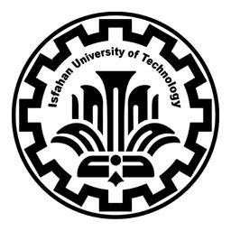

## Table of Contents
- [About Me](#about-me)
- [Education](#education)
- [Research Interests](#research-interests)
- [Experience](#experience)
- [Publications](#publications)
- [Awards & Honors](#awards--honors)
- [CV](#cv)

## About Me

## Education

  
  

    <strong>Sharif University of Technology</strong> 
    M.Sc. in Computer Engineering (Artificial Intelligence) 
    2025 
  

 

  
  

    <strong>Isfahan University of Technology</strong> 
    B.Sc. in Electrical and Electronics Engineering (Control) 
    2020 - 2025 
    <ul style="padding-left: 1em; margin-left: 0; list-style-position: outside;">
      <li>Additionally, <strong>completed core Computer Engineering coursework</strong> through selective and independent study</li>
      <li>Achieved a <strong>perfect score</strong> (20/20) in <strong>over 16 specialized courses</strong> in both EE & CE</li>
      <li>B.Sc. project: 'Efficient and Vivid Image Colorization via Spectrally-Normalized GAN'</li>
    </ul>
  

 

## Research Interests

## Experience

  
  

    <strong>Teaching Assistant</strong> 
    Isfahan University of Technology 
     
    <ul style="padding-left: 1em; margin-left: 0; list-style-position: outside;">
      <li>
        <strong>Machine Learning</strong> 
        Feb 2025 - Jul 2025 · 6 mos 
        Instructed by Dr. Mehran Safayani 
      </li> 
      <li>
        <strong>Robotics</strong> 
        Feb 2025 - Jul 2025 · 6 mos 
        Instructed by Dr. Hamed Jalaly
      </li>
    </ul>
  

 

## Publications

## Awards & Honors
- Ranked **2nd nationwide** among ~18,000 participants in the 2025 M.Sc. Entrance Exam (Konkor) in **Computer Engineering**

## CV
<a href="CV_download_link" target="_blank"
   style="display:inline-block; background-color:#4CAF50; color:white;
          padding:0.5em 1em; text-decoration:none; border-radius:0.3em; font-size:1em;">
  Download CV
</a>